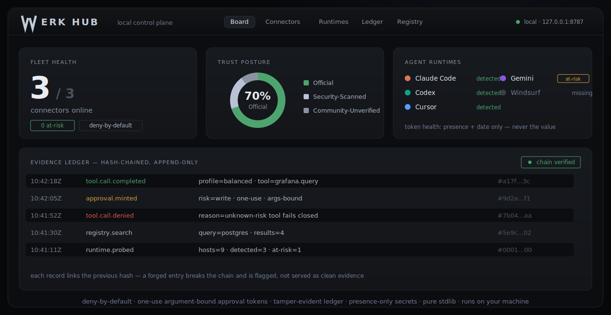

# WERKHub

[](CHANGELOG.md)
[](https://www.python.org/downloads/)
[](LICENSE)
[](tests)
[](https://github.com/astral-sh/ruff)
[](https://mypy-lang.org/)

> **One local MCP front door for all your agent tools — with policy gates, approvals, and a tamper-evident evidence ledger.**

WERKHub is the control layer I wanted before letting agents touch real tools.
No invisible routing. No blind trust. No random tool calls flying around without a trace.

Your agent host connects to **one** MCP server: WERKHub.  
WERKHub then routes calls to Claude Code, Codex, Cursor, local MCPs, model workers, vault tools, trace tools, and whatever else you wire in — but every call goes through the same local gate.



---

## The short version

| Layer | What WERKHub does |
|---|---|
| **Front door** | Exposes 8 always-on bridge tools through one MCP server. |
| **Policy gate** | Deny-by-default. Unknown tools do not run. Risky tools need approval. |
| **Evidence** | Every decision and tool call is written to a hash-chained JSONL ledger. |
| **Secrets** | Env-var key names are detected, values are not stored. |
| **Dashboard** | Local supervisor console for fleet health, connectors, approvals, and ledger tail. |
| **Tests** | 1069 tests, offline-first, Linux + Windows CI. |

---

## Why this exists

Agent tooling is getting powerful, but the wiring is still messy.

Each host — Claude Code, Codex, Cursor, Windsurf, Gemini, Kimi, Antigravity — tends to manage MCP servers on its own. That means every tool stack gets its own config, its own trust story, and usually no shared audit trail.

WERKHub makes that boring in the best way:

```text
Agent host
  ↓
WERKHub MCP gateway
  ↓
Policy / approval gate
  ↓
Downstream MCP tools
  ↓
Hash-chained evidence ledger
```

The idea is simple: agents can do work, but the operator should still see what happened, what was allowed, what was denied, and what needs human approval.

---

## What it ships

`werktools` is the Python package. **WERKHub** is the product layer inside it.

It currently includes:

- **`werktools hub serve`** — stdio MCP gateway with 8 bridge tools.
- **`werktools hub onboard`** — scans existing host MCP configs and adopts them as connectors.
- **`werktools hub doctor`** — runtime detection + machine-checked invariants.
- **`werktools hub dashboard`** — local HTTP dashboard, loopback-first, CSP-safe.
- **Approval queue** — one-use, argument-bound, expiring tokens.
- **Hash-chained ledger** — verified reads via `chain_verified`.
- **Downstream relay** — discovery, forwarding, per-downstream `cwd`, stderr diagnostics, failure classifier.
- **Trust taxonomy** — `Official`, `Security-Scanned`, `Community-Unverified`.
- **Local tool slices** — truth, mine, trace, vault, data-gate, swarm, cost, eval, audit, skills, integration-gate.
- **Desktop supervisor** — `desktop/`, built with Deno Desktop + Vite + React + Tailwind.

---

## Current status

**Version:** `0.1.0`  
**Core:** Python ≥ 3.10, stdlib-only core  
**License:** AGPL-3.0-or-later  
**Package name:** `werktools`  
**Product name:** `WERKHub`

### Working now

- MCP front door with 8 bridge tools:
  - `tool_search`
  - `tool_describe`
  - `tool_call`
  - `profile_info`
  - `ledger_recent`
  - `approval_status`
  - `hub_status`
  - `registry_search`
- Deny-by-default policy gate via `enforce()`.
- File-based approvals with one-use, argument-bound tokens.
- Tamper-evident JSONL ledger with verified-chain reads.
- Downstream MCP discovery + policy-gated forwarding.
- Runtime/onboarding Doctor for Claude, Cursor, Windsurf, Gemini, Kimi, Antigravity, Codex.
- Local dashboard and desktop supervisor console.
- 1069 passing tests.

### Experimental / honest limits

- The dashboard `kill` action is gated and wired defensively, but still preview-level under stub process wiring.
- Tier-1 allowlist entries currently carry `digest=unpinned` trust notes. OCI digest backfill is planned.
- Single-instance downstream MCPs are detected, but not solved yet. The relay currently spawns a fresh subprocess per call; attach/reuse is on the roadmap.
- The package is not published to PyPI yet. Install from a clone for now.

---

## Architecture

WERKHub separates the agent-facing interface, the policy layer, the relay, and the truth layer.

```text
┌──────────────────────────────────────────────────────────┐
│ Interface                                                │
│ Agent host over stdio MCP                                │
│ Desktop console over loopback HTTP                       │
│ werktools CLI                                            │
├──────────────────────────────────────────────────────────┤
│ Front door                                               │
│ werk-hub MCP server                                      │
│ 8 always-on bridge tools                                 │
├──────────────────────────────────────────────────────────┤
│ Control                                                  │
│ deny-by-default policy gate                              │
│ one-use approvals                                        │
│ argument-bound tokens                                    │
│ trust tiers + allowlist                                  │
├──────────────────────────────────────────────────────────┤
│ Relay                                                    │
│ downstream MCP discovery                                 │
│ policy-gated forwarding                                  │
│ stderr diagnostics                                       │
│ failure classification                                   │
├──────────────────────────────────────────────────────────┤
│ Truth                                                    │
│ hash-chained JSONL ledger                                │
│ SQLite registry.db                                       │
│ hub.json config                                          │
└──────────────────────────────────────────────────────────┘
```

---

## Repository layout

```text
WERKHub/
├── src/werktools/
│   ├── hub/              # MCP gateway: server, relay, policy, approvals, ledger, registry
│   ├── tools/            # local slices: truth, trace, vault, cost, swarm, audit, skills, ...
│   └── *.py              # shared primitives: envelope, profile, redaction, classify, ledger
├── desktop/              # Deno Desktop supervisor console, Vite/React/Tailwind
├── docs/                 # MkDocs site, ADRs, concepts, setup docs
├── examples/             # small MCP demos
├── tests/                # 59 test files, 1069 tests
├── CHANGELOG.md
├── SETUP.md
├── SECURITY.md
├── CONTRIBUTING.md
├── LICENSE
└── pyproject.toml        # Python package: werktools
```

---

## Installation

Requires **Python ≥ 3.10**.

Until `werktools` is published to PyPI, install from a clone:

```bash
git clone https://github.com/Shuwajaja/WERKHub.git
cd WERKHub
pip install -e ".[server]"
```

Run the MCP gateway:

```bash
werktools hub serve --config .werktools/hub.json
```

Run the local dashboard:

```bash
werktools hub dashboard --port 7879 --open
```

When the package is published to PyPI, the clean one-liner will be:

```bash
uvx --from "werktools[server]" werktools hub serve
```

### Extras

| Extra | Purpose |
|---|---|
| `server` | Installs the FastMCP runtime needed for `werktools hub serve`. |
| `yaml` | Adds YAML parsing helpers. |
| `swarm` | Keeps the swarm helper install path stable without pulling extra runtime deps. |
| `lifecycle` | Reserved marker for process-supervision extensions while the current implementation stays stdlib-only. |
| `worker` | Adds the HTTP client used for model-worker dispatch. |
| `onboard` | Adds TOML support for reading Codex configs on Python 3.10. |
| `all` | Installs every optional extra in one step. |

---

## 30-second onboard

The Doctor can adopt the MCP servers already configured in your agent hosts.

```bash
# 1. Create or inspect local hub config
werktools --config .werktools/hub.json hub init
werktools --config .werktools/hub.json hub status

# 2. Dry-run existing MCP discovery
werktools hub onboard

# 3. Adopt discovered MCPs into hub.json
WERK_ALLOW_HUB_ONBOARD=1 werktools hub onboard --apply

# 4. Start the hub profile
werktools hub serve --profile claude-reviewer --config .werktools/hub.json
```

Then point your agent host at WERKHub as its MCP server.

```json
{
  "mcpServers": {
    "werkhub": {
      "command": "werktools",
      "args": ["hub", "serve", "--profile", "claude-reviewer", "--config", ".werktools/hub.json"]
    }
  }
}
```

---

## Bridge tools

Agents do not call every downstream tool directly. They go through WERKHub's bridge tools.

| Tool | Purpose |
|---|---|
| `tool_search` | Find available downstream tools. |
| `tool_describe` | Inspect one tool before calling it. |
| `tool_call` | Execute a policy-gated downstream call. |
| `profile_info` | Show the active pinned profile. |
| `ledger_recent` | Read recent verified ledger events. |
| `approval_status` | Check pending/approved/denied approval records. |
| `hub_status` | Inspect hub health and connector state. |
| `registry_search` | Search the capability registry when profile policy allows it. |

This keeps the surface small. The agent gets power, but the operator gets one control point.

---

## Development

```bash
pip install -e ".[all]"

pytest -q
python -m mypy src/werktools
python -m ruff check src tests examples
python -c "from werktools.hub.invariants import run_all; print(run_all())"
```

Desktop app:

```bash
cd desktop
pnpm install
pnpm dev
```

Run the dashboard sidecar separately:

```bash
werktools hub dashboard --port 7879
```

---

## Configuration

WERKHub is configured through `hub.json`.

| Config piece | Meaning |
|---|---|
| `hub.json` | Connectors, profiles, tools, ledger path, allowlist path. |
| `--config <path>` | Selects the hub config. Default: `.werktools/hub.json`. |
| `--profile <id>` | Pins the active profile at launch. |
| `WERKTOOLS_HUB_PROFILE` | Env alternative to `--profile`. |
| Connector `env` | Stores env-var key names only, not secret values. |

Mutation flags are fail-closed and opt-in:

```text
WERK_ALLOW_HUB_APPROVALS
WERK_ALLOW_HUB_ONBOARD
WERK_ALLOW_HUB_KILL
WERK_ALLOW_HUB_CONFIG_WRITE
WERK_ALLOW_HUB_REGISTRY
```

Dashboard mutations also require a per-session `X-Werk-Token`.

See [SETUP.md](SETUP.md) for the full self-test.

---

## Security model

WERKHub is local-first, but it does not pretend local equals safe.

Project rules:

- **Deny-by-default, fail-closed.** A tool runs only when `enforce()` returns `allow`.
- **Unknown means no.** Unknown profile, unknown tool, unknown risk: denied.
- **Secrets stay presence-only.** Config stores env-var key names, not values.
- **Approvals are one-use.** Tokens are argument-bound, expiring, and consumed once.
- **Ledger is evidence, not decoration.** Every important decision is append-only and hash-chained.
- **No telemetry.** Local HTTP binds loopback by default; network surfaces are explicit.

Read [SECURITY.md](SECURITY.md) for the threat model and known limits.

---

## Agent usage

This repo is designed to be changed by humans and AI coding agents.

Agents working **on this repo** should:

- inspect existing structure before editing;
- keep changes small and reviewable;
- run `pytest -q`, `mypy`, `ruff`, and the invariant gate before claiming success;
- keep the core dependency-free;
- never add daemon loops to core modules;
- treat JSONL events, SQLite, and the ledger as truth;
- preserve evidence and avoid deleting files unless explicitly instructed.

Agents **using WERKHub** reach downstream tools only through the bridge surface. Risky calls return a `request_id` and must be retried with a human-approved, argument-bound token.

---

## Roadmap

- [ ] Publish `werktools` to PyPI.
- [ ] Add connection reuse / attach-to-running for single-instance downstream MCPs.
- [ ] Backfill OCI digests for the Tier-1 install allowlist.
- [ ] Finish live process supervision behind the dashboard `kill` action.
- [ ] Windows code-signing for the desktop `.msi`.
- [ ] Public docs polish + launch examples.

---

## Docs

| Topic | File |
|---|---|
| Setup & self-test | [SETUP.md](SETUP.md) |
| Security model | [SECURITY.md](SECURITY.md) |
| Contributing | [CONTRIBUTING.md](CONTRIBUTING.md) |
| Changelog | [CHANGELOG.md](CHANGELOG.md) |
| MkDocs site | [docs/](docs/) |

---

## License

AGPL-3.0-or-later. See [LICENSE](LICENSE).

Security issue? Use the private reporting path in [SECURITY.md](SECURITY.md). Do not open a public issue for vulnerabilities.
